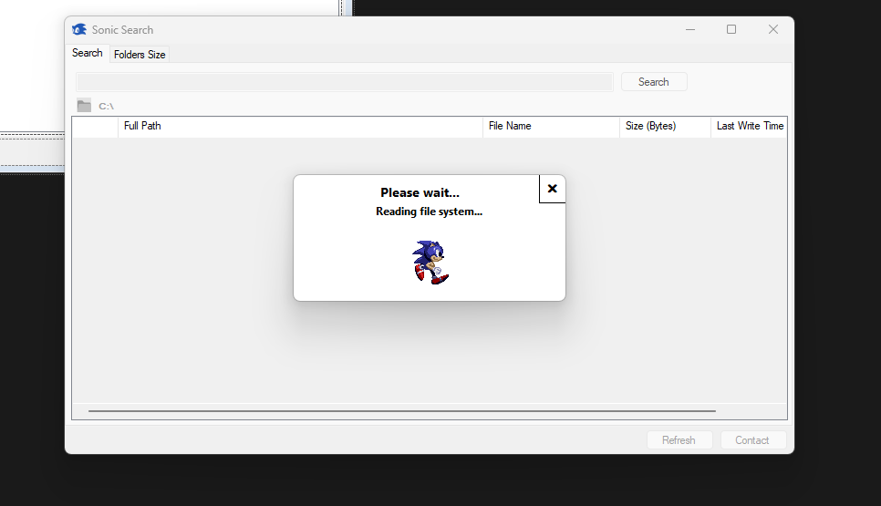
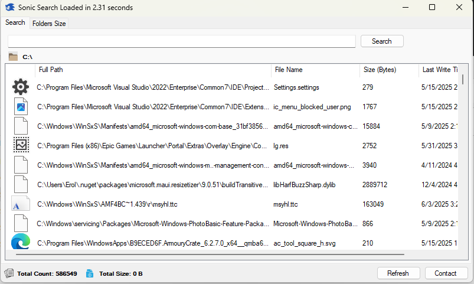
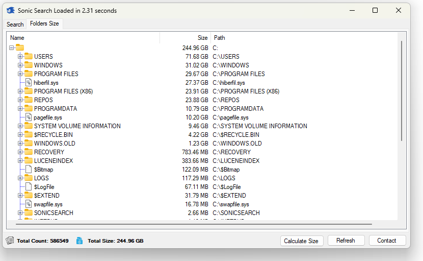

 I built an open-source tool called **Sonic Search** – it's a super-fast file search and folder size analysis tool specifically built for NTFS file systems. It leverages the Master File Table (MFT) for raw, blazing-fast performance.

- MFT-based indexing (millions of files in seconds)
- Instant file search with:
  - Wildcard
  - Regex
  - Fuzzy/partial matching
- Folder size calculation across the entire system
- Clean modern UI with right-click file actions
- Fully open source

**1. Indexing 1.8M files in 6 seconds**  

**2. Instant search results, even for fuzzy/wildcard queries**  

**3. Full disk folder size calculations**  

  
- Uses [ObjectListView for .NET](https://objectlistview.sourceforge.net/cs/index.html)  
 You’ll need to install [ObjectListView.Official](https://www.nuget.org/packages/ObjectListView.Official/) NuGet package to compile the project.

