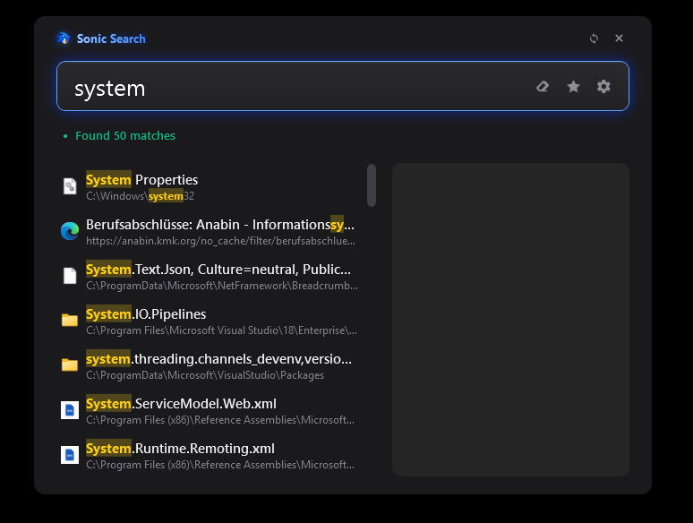
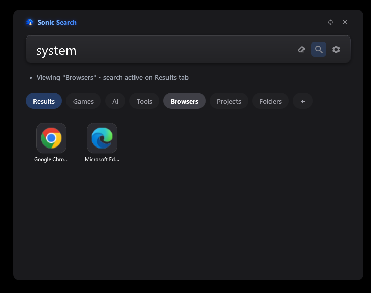
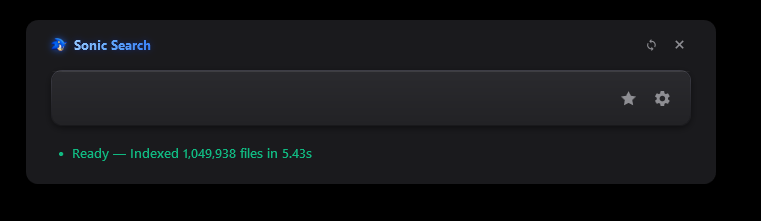
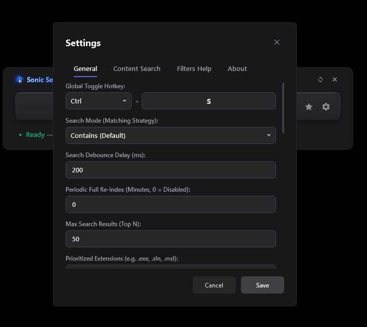

# Sonic Search

A super-fast file search tool for NTFS drives on Windows. Instead of walking folders like normal file search, it reads the NTFS **Master File Table (MFT)** directly, so it can index millions of files in seconds and search them instantly.

## How it works

- **MFT-based indexing** — one pass over the raw NTFS volume via the `NtfsReader` library builds an in-memory index of every file and folder on the drive.
- **USN Journal for incremental updates** — after the initial scan, Sonic Search polls the NTFS USN change journal so new/renamed/deleted files update the index without a full re-scan.
- **Filename-prefix trie** — accelerates the common case of typing the start of a filename, on top of a parallel full-snapshot scan for everything else (substrings, wildcards, qualifiers).
- **Content search** — optional full-text search inside file contents (`content:`), run in parallel across candidate files.
- **Optional background indexing service** — the MFT/USN journal reads need admin rights, which normally means the whole app has to run elevated. Elevated windows can't accept drag-and-drop from an unelevated Explorer (Windows blocks it, by design), so Sonic Search can instead install a small Windows Service that does the privileged reading and hands the GUI its data over a named pipe. With that on, the GUI itself runs unelevated — no UAC prompt, and drag-and-drop from Explorer works.

## Features

- Instant search with Contains / Starts With / Exact / Regex / wildcard (`*`, `?`) matching modes
- Multi-drive indexing — pick which drives to index and search across (Settings → Indexing)
- Filter qualifiers you can combine freely:
  - `ext:` / `type:` — by file extension
  - `folder:` / `file:` — folders or files only
  - `size:` — e.g. `size:>10mb`, `size:<500kb`
  - `date:` / `modified:` — e.g. `date:today`, `date:>7d`
  - `location:` / `path:` / `in:` — e.g. `location:desktop`, `path:downloads`, or any custom path
  - `drive:` — restrict to one indexed drive, e.g. `drive:d`
  - `content:` / `text:` — search inside file contents
- Autocomplete with search history — including recalling filter values you've used before (e.g. typing `loc` suggests `location:desktop` if you searched that before)
- Browser bookmarks (Chrome/Edge) show up alongside file results when their title matches
- Built-in Windows tools (Device Manager, Control Panel, Services, ...) show up the same way
- Packaged/Store apps (e.g. Claude) stay launchable from Favorites/search even after they auto-update, by resolving their stable AppUserModelId instead of a version-baked path
- Favorites, organized into groups, shown as an icon grid with a live search box of their own
- Drag-and-drop from Explorer (requires the background indexing service - see above)
- Global hotkey to summon the search window from anywhere, from a tray icon it hides to instead of quitting
- Optional launch at Windows startup, hidden straight to the tray
- Optional Always on Top
- File preview, icons, and execution-frequency-based result ranking
- Settings organized into categories (Search, Indexing, Behavior, Content Search, Filters Help, About) instead of one long list
- Fully open source

See the in-app **Settings → Filters Help** tab for the full filter reference, and **Settings → About** for version info.

## Requirements

- Windows with an NTFS-formatted drive
- .NET Framework 4.8
- **Administrator rights** — reading the raw NTFS volume and the USN journal requires elevation. Without the background indexing service (see above), the app self-elevates via UAC on launch; with it enabled, only the one-time service install needs elevation and the GUI itself runs unelevated afterward.

## Building

Open `SonicSearch.sln` in Visual Studio, or from the command line:

```bash
dotnet build SonicSearch.sln -c Release
```

The solution has four projects:
- `NtfsReader` — the MFT/USN reading library (based on Jeroen Kessels' JkDefrag, LGPL-licensed)
- `SonicSearch` — the WPF application (the GUI)
- `SonicSearch.Service` — the optional Windows Service that does privileged MFT/USN reads on behalf of an unelevated GUI (see "Optional background indexing service" above)
- `SonicSearch.Contracts` — shared types (the wire protocol) between `SonicSearch` and `SonicSearch.Service`

## License

Sonic Search's own code (`SonicSearch`, `SonicSearch.Service`, `SonicSearch.Contracts`) is MIT-licensed - see [LICENSE](LICENSE). `NtfsReader/` is a separate third-party library under LGPL-2.1 - see [NtfsReader/License.txt](NtfsReader/License.txt).

## Screenshots

| | |
|---|---|
|  |  |
|  |  |
